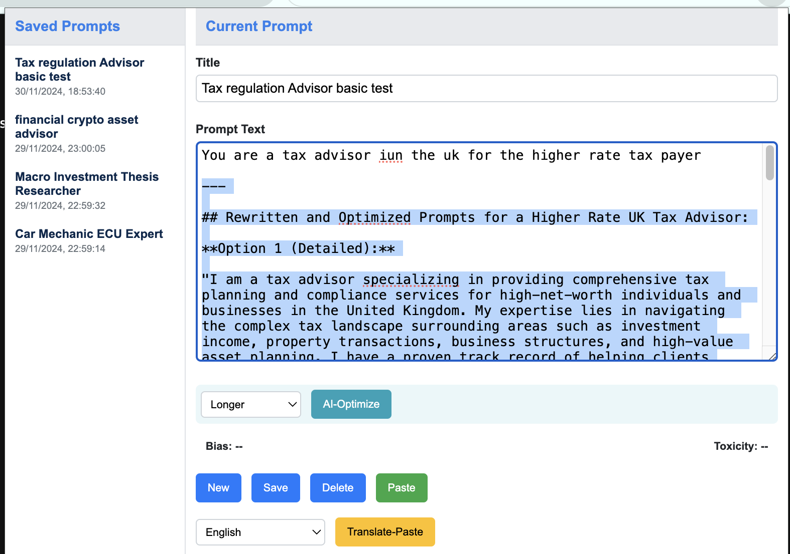
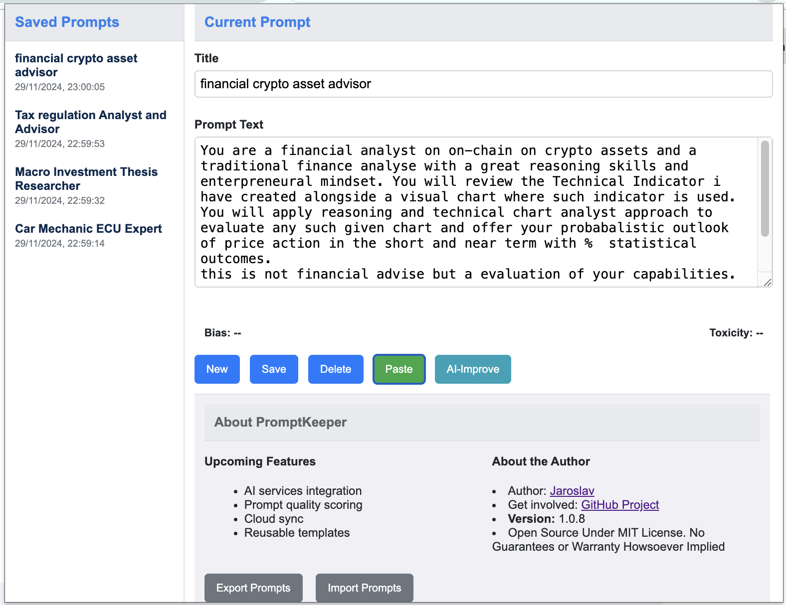

# PromptKeeper

## Vision

PromptKeeper is designed to help optimise how we interact with generative AI LLMs.
It addresses the challenge of managing, fine-tuning, and reusing engineered prompts in a user-friendly and efficient way.
It's all about the conversation - The Context and Intent. PromptKeeper helps you create your own library of Intentional and Bespoke assistants in the form of polished and refined Prompts in your library. You can chose to Export and share these with your friends and family.

### Privacy First
The Gemini AI AI models used for refining These prompts are running on your local Chrome browsers, adn they are local to your runtime environment. There is no plan to share or send any data to anyone else to help you maintain your sovereign data, and privacy.

## Proposed Solution

This Google Chrome extension allows users to easily write, save, and reuse prompts across various LLMs. It brings a convenient tool right into the browser, enhancing the workflow of AI enthusiasts, researchers, and professionals.

### Update: This is Release v1.0.9 (Release Preview with Chrome In-built AI Capabilities)

In this release preview, we've integrated Chrome's built-in AI capabilities to enhance the functionality of PromptKeeper. Note that these features are currently in alpha and are expected to be officially available in **Summer 2025**.

I have registered as  Chrome Developer to get access to Alpha release with Gemini Nano Model access, and the latest [Chrome documentation can be found here with upcoming release and capability maturity dates](https://developer.chrome.com/docs/ai?authuser=1)

**New Features:**

- **Prompt Optimization Capability:**
  - Allows users to optimize their prompts using AI-powered suggestions.
  - Users can select from a dropdown list of options such as "More Creative," "More Concise," "More Formal," etc.
  - Enhances the quality and effectiveness of your prompts with just a few clicks.

- **Paste-Translated Capability:**
  - Enables users to translate their prompts into different languages directly within the extension.
  - Supports multiple languages, making it easier to work with a global audience.
  - Translated text can be pasted directly into focused input fields on web pages.

**Enabling Chrome In-built AI Capabilities:**

To use these new features, you need to enable certain flags in Chrome to access the beta APIs.

#### Required Chrome Flags:

1. **Enable the Prompt API for Gemini Nano:**
   - Navigate to `chrome://flags/#prompt-api-for-gemini-nano`.
   - Set it to **Enabled**.
   - Description: *Enables the exploratory Prompt API, allowing you to send natural language instructions to a built-in large language model (Gemini Nano in Chrome).*

2. **Enable the Translator API:**
   - Navigate to `chrome://flags/#translation-api`.
   - Set it to **Enabled** or **Enabled without language pack limit** (for testing with more language pairs).
   - Description: *Enables the Translator API, allowing you to translate text in the browser using local AI models.*

3. **Restart Chrome** to apply the changes.

**Important Notes:**

- These in-built AI capabilities are in **alpha** until **Summer 2025** and are subject to change.
- This release preview is intended for testing and development purposes and will **not** be released to the general public or published in the Chrome Web Store.
- We are sharing this update on GitHub to collaborate with other teams and gather feedback.

**Screenshots:**

*Prompt Optimization Feature:*

*Paste-Translated Feature:*

### WIP

### Previous Update: Release v1.0.8

### Video Demo of v1.0.7

## About the Project

PromptKeeper features a minimalist chrome extension that opens as a floating tab within a browser window, much like a bookmark sidebar. 
Key features include:

- **Integration with AI services for testing** (On the roadmap to release once confirmed)
- **Automated prompt quality scoring** (Using the same private models)
- **User-defined prompt templates for quick reuse**
- A title label and text box area for prompt management.
- Local version control for tracking changes, similar to Git.
- Ability to tag and save current versions.
- Export functionality for both individual and collective prompts in JSON format.

This project is especially useful for those who regularly interact with various LLMs and seek a more organized and efficient way to work and manage their prompts.

## About the Author

Jaroslav is a seasoned technical leader in cloud infrastructure engineering, combining over 16 years of experience with a passion for the exponential age and generative AI. His diverse skill set in technology and keen interest in forward-thinking trends make him a valuable mentor and thought leader in the tech community.

As a pseudo developer, he is keen to prove acceleratod value enablement and creation wiht generative AI capabilities by creating Apps, Solutions and Open Source Projects to inspire and excite all non-developers to get hands on, and get creative to do the same.

For more about Jaroslav Pantsjoha's professional journey, visit his [LinkedIn Profile](https://www.linkedin.com/in/johas) and [Medium Blog](https://jaroslav-pantsjoha.medium.com/).

## Technical Details

This project is proudly rapidly developed with Open AI and Gemini Premium Large Language Models, as well as Locally Hosted LLMs with the magic simple use of [Ollama](https://ollama.com). 

[Read More on How-To here](https://faun.pub/your-private-ai-playground-a-beginners-guide-to-offline-models-on-your-local-machine-7a078f70bbef)

---

For more information and updates on PromptKeeper, stay tuned to this repository.

---