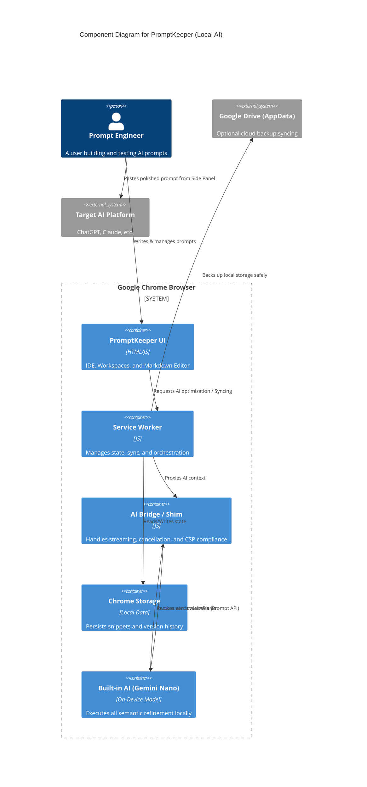

# PromptKeeper - The Local AI Prompt IDE

[](https://chromewebstore.google.com/detail/promptkeeper/donmkahapkohncialmknoofangooemjb)
[](LICENSE.md)

**PromptKeeper** is a privacy-first Chrome Extension that transforms your browser into a local prompt engineering workspace. Save, organize, version, and optimize your AI prompts—with real-time quality scoring, Google Drive sync, and built-in Markdown support.

> 🚀 **[Install from Chrome Web Store](https://chromewebstore.google.com/detail/promptkeeper/donmkahapkohncialmknoofangooemjb)**

---

## ✨ Key Features (v2.2)

| Feature | Description |
|---------|-------------|
| 🎯 **Prompt Coach** | **NEW!** Real-time AI-powered prompt quality scoring (0-100) with visual hashtag tags (`#persona`, `#context`, `#templated`). Guides you toward better prompts as you type. |
| 🔀 **Prompt Sorting** | **NEW!** Sort prompts by Name (A-Z/Z-A), Newest First, Oldest First, or Recently Modified. |
| 🎨 **Theme Toggle** | **NEW!** Choose Light, Dark, or Auto (system) theme. Consistent across Side Panel and Options page. |
| ⌨️ **Keyboard Shortcuts** | **NEW!** Configure side panel hotkey via settings. Default: `Ctrl+Shift+P` / `⌘+Shift+P`. |
| 🎯 **Placeholder UX** | **NEW!** Smart template placeholders: `[text]` and `{{mustache}}` are highlighted in preview. Click to auto-select in editor. Double-click to select entire pattern. |
| 📝 **Markdown Support** | Rich text preview with **bold**, *italics*, lists, and headers, plus **Click-to-Edit** previews. |
| 🧠 **Local AI (Gemini Nano)** | On-device optimization using Chrome's Gemini Nano APIs. Includes **Magic Enhance**, **Formalize**, **Improve Clarity**, **Shorten**. |
| ⚡ **Streaming + Cancel AI** | AI output streams into the editor progressively. Click **Stop** to abort long operations safely. |
| ☁️ **Google Drive Sync** | Auto-backup to your private Drive. Access prompts on any device. |
| 🗂️ **Workspaces** | Organize prompts into Projects with drag-and-drop. |
| 📜 **Version History** | Every save is versioned. Time-travel to restore any version. |
| 🖥️ **Full-Screen IDE** | A spacious editor for serious prompt engineering with a resizable, scrollable right-hand options & AI panel. |

---

## 🚀 Getting Started

### Install from Chrome Web Store (Recommended)
1. Visit the [Chrome Web Store listing](https://chromewebstore.google.com/detail/promptkeeper/donmkahapkohncialmknoofangooemjb)
2. Click **Add to Chrome**
3. Pin the PromptKeeper icon 📌 to your toolbar

### Enable Gemini Nano (Local AI Features)
PromptKeeper supports Chrome's built-in **Gemini Nano** for private, local prompt optimization.

1. Go to `chrome://flags`
2. Enable **Optimization Guide On Device Model** (`#optimization-guide-on-device-model`)
3. Enable **Prompt API for Gemini Nano** (`#prompt-api-for-gemini-nano`)
4. Relaunch Chrome

**Note**: Once valid, the **"AI Optimization"** tile in the Manage Page and the **"Magic Optimize"** buttons in the Side Panel will appear automatically.
While AI is running, buttons will switch to **Cancel**, and on supported builds you may see **streaming output** in the editor.

---

## 📖 How It Works

### 🎥 v2.2 Demo

PromptKeeper v2.2 brings the intelligence of **Chrome's built-in Gemini Nano** to your browser, featuring real-time **Prompt Coaching**, **Dark Mode**, and **Smart Sorting**—running completely locally and privately.

[](https://www.youtube.com/watch?v=istJeTS1UOs)  
[Watch the Full Demo on YouTube (v2.2)](https://youtu.be/istJeTS1UOs)

### 🤖 Built-In Gemini Nano Support

Enjoy absolute privacy and zero latency. With Chrome's local AI, all optimizations—like identifying prompt weaknesses or auto-correcting context—are processed on your device. Here is a look at the seamless side panel integration:


### Full-Screen IDE
Click **Manage Prompts** in the popup (or right-click → Options):
- **Left Sidebar**: Workspaces and prompt list.
- **Center**: Rich text editor with live word and character count.
- **Right Panel**: AI tools, editor options (including font size), and Google Drive settings. The panel is resizable and scrollable so nothing gets hidden.
- **Footer**: Version history selector, storage stats, and live `Words / Chars / Size` summary.

### Quick Popup & Side Panel
Click the extension icon for quick access:
- View and copy prompts instantly.
- **Paste to Page**: Insert prompts directly into ChatGPT, Claude, etc.
- Open the **Side Panel** for a compact version of the editor that shares the same font settings and AI tools. A single click on **Manage ↗** takes you into the full-screen IDE when you need more space.

---

## 🏗️ Architecture & How It's Built

PromptKeeper is designed around Chrome's cutting-edge **Built-in AI (Gemini Nano)**. By moving AI execution directly to the client side, we eliminate server round-trips, ensuring zero latency, offline capability, and total data privacy.

### Benefits of Chrome's Built-in AI Integration
Here's how PromptKeeper utilizes the [Chrome Prompt API](https://developer.chrome.com/docs/ai/built-in) to deliver a superior developer experience:
- **Total Privacy (End-to-End Local Processing):** Your prompts, which often contain sensitive API keys or proprietary business logic, never leave your device.
- **Snappy User Experience:** Bypassing standard cloud inference delays lets our **Prompt Coach** score your inputs and suggest improvements in real-time as you type.
- **Hardware Acceleration:** Chrome's AI runtime dynamically optimizes inference using your machine's GPU/NPU for peak efficiency.

**Features Fully Powered by Gemini Nano in v2.2.0:**
* **Prompt Coach:** Real-time semantic analysis to score prompt strength.
* **Magic Enhance:** Fills in missing context and expands details.
* **Formalize & Clarify:** Rewrites prompts for a cleaner, professional tone.
* **Shorten:** Condenses long-winded logic into punchy instructions without losing meaning.

### C4 Component Diagram
This C4 Container diagram illustrates the application boundary and local hardware optimizations:



### User Journey Flow
```text
[ User ] -> Opens Side Panel on ChatGPT/Claude
   |
   +--> Types rough prompt: "write a python script to parse logs"
   |
   +--> [ PromptKeeper Editor ]
          |-- Real-time trigger -> [ Prompt Coach (Gemini Nano) ]
          |-- Evaluates Constraints, Persona, Clarity
          |<- Returns Score: 45/100, Needs "#persona"
   |
   +--> User clicks "Magic Enhance"
          |-- Sends context -> [ AI Bridge / Shim ] -> [ Gemini Nano ]
          |-- Streams output -> "Act as a Senior Python Developer. Write a robust script..."
          |-- Saves new revision to [ Chrome Storage ]
   |
   +--> User clicks "Copy" or "Paste to Page" -> Injects straight into target website
```

---

## 🔒 Privacy & Security

| | |
|---|---|
| **Local Storage** | All data stored in `chrome.storage.local` by default |
| **Drive Isolation** | Google Drive access limited to hidden AppData folder only |
| **On-Device AI** | Gemini Nano runs entirely on your machine |
| **No Tracking** | Zero analytics, no third-party services |

---

## 🛠️ Development

```bash
# Install dependencies
npm install

# Run tests
npm run lint
npm test
npm run test:e2e
```

See `docs/TEST_STRATEGY.md` for the full coverage matrix and E2E suite list.

See [DEPLOYMENT_GUIDE.md](DEPLOYMENT_GUIDE.md) for packaging instructions.

---

## 📄 License

ISC License. See [LICENSE.md](LICENSE.md).

---

**Built with ❤️ by [Jaroslav Pantsjoha](https://github.com/pantsjj)**
