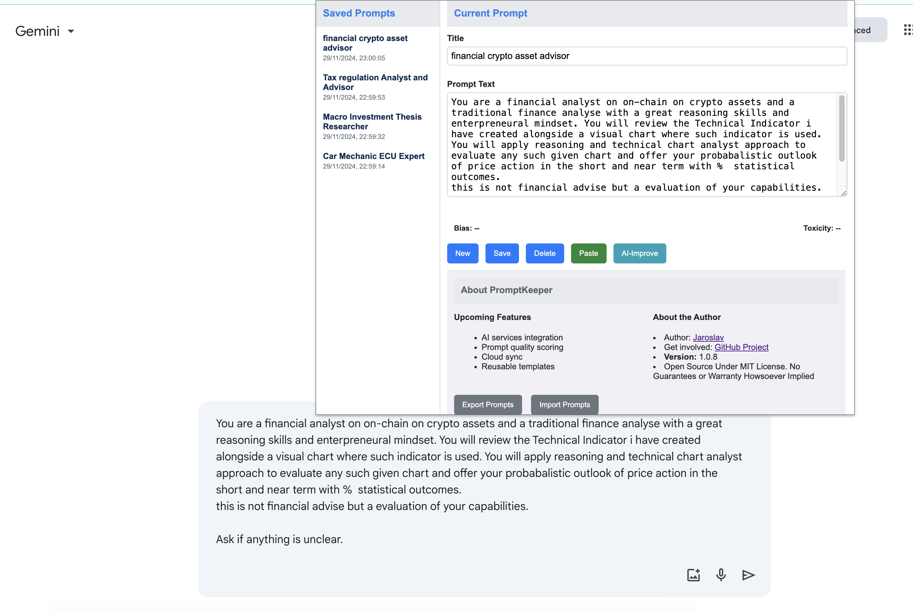

# PromptKeeper

## Vision
PromptKeeper is designed to help improve how we interact with generative AI LLMs. It addresses the challenge of managing, fine-tuning, and reusing engineered prompts in a user-friendly and efficient way.

## Proposed Solution
This Google Chrome extension allows users to easily write, save, and reuse prompts across various LLMs. It brings a convenient tool right into the browser, enhancing the workflow of AI enthusiasts, researchers, and professionals.

### Update: This is Release v1.0.8

### Video Demo of v1.0.7

## About the Project
PromptKeeper features a minimalist, monochrome widget that opens as a floating tab within a browser window, much like a bookmark sidebar. Key features to include:
- Integration with AI services for testing
- Automated prompt quality scoring
- Cloud synchronization of prompts across devices
- User-defined prompt templates for quick reuse
- A title label and text box area for prompt management.
- Local version control for tracking changes, similar to Git.
- Ability to tag and save current versions.
- Export functionality for both individual and collective prompts in JSON format.

This project is especially useful for those who regularly interact with various LLMs and seek a more organized and efficient way to work & manage their prompts.

## About the Author

Jaroslav is a seasoned technical leader in cloud infrastructure engineering, combines over 16 years of experience with a passion for the exponential age and generative AI. His diverse skill set in technology and keen interest in forward-thinking trends make him a valuable mentor and thought leader in the tech community.

For more about Jaroslav Pantsjoha's professional journey, visit his [LinkedIn Profile](https://www.linkedin.com/in/jaroslav-pantsjoha) and [Medium Blog](https://jpantsjoha.medium.com/).

## Technical Details
This project is rapidly developed with [Duet AI](https://cloud.google.com/duet-ai), [GPT4](https://openai.com/gpt-4) and [GitHub CoPilot](https://github.com/features/copilot) 

---

For more information and updates on PromptKeeper, stay tuned to this repository.
