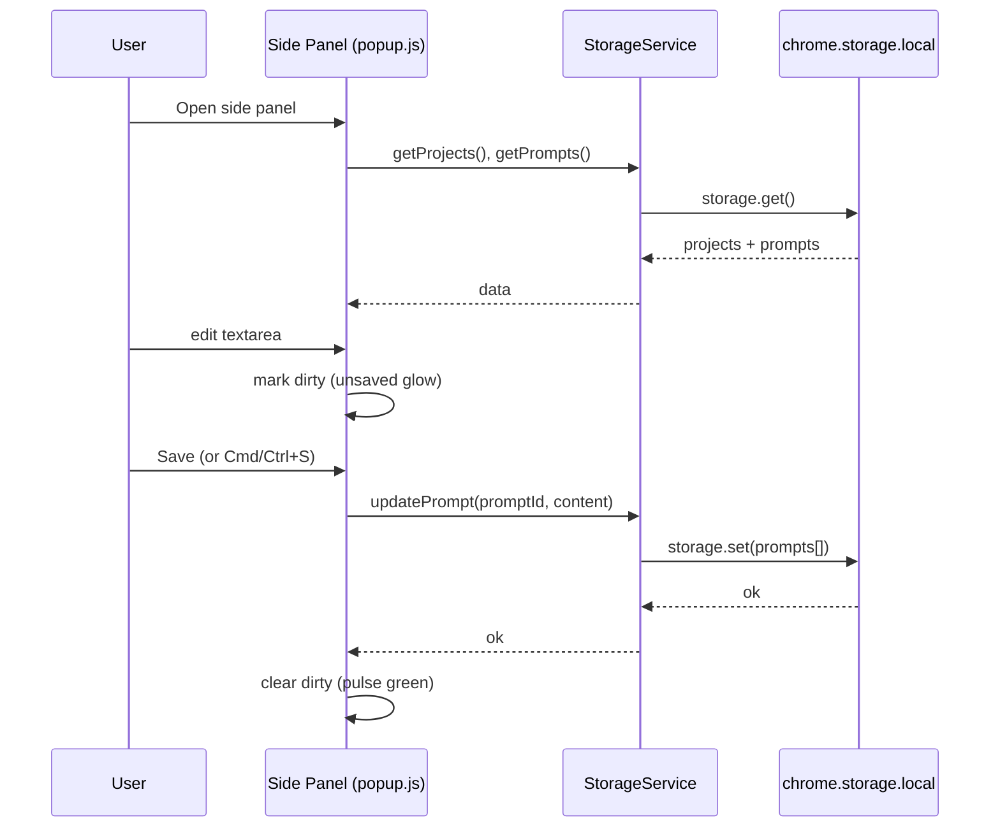
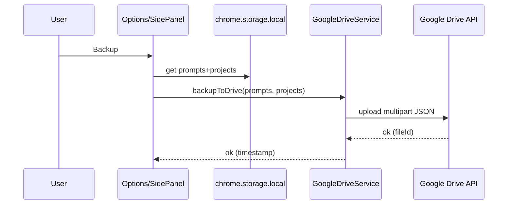

# PromptKeeper Extension — Solution Architecture (HLD)

## Purpose

This document explains how PromptKeeper works end-to-end:

- **User journeys** (side panel, full editor, paste-to-page, AI optimize, backup/restore)
- **Component interactions** (MV3 service worker, offscreen document, UI pages, content script)
- **Data flow & state** (storage schema, versioning, autosave behavior, settings propagation)
- **Logging & diagnostics** (what we log, where, and why)

It reflects the **current implementation** and the **directional upgrades** adopted from `web-ai-demos` (central Built-in AI wrapper, streaming, abort/cancel, download progress).

## Scope & non-goals

- **In scope**: architecture and design decisions for PromptKeeper’s Chrome extension surfaces and services.
- **Out of scope**: full UI spec, full ADR history, or product roadmap detail.

## Key references

- **ADR-004**: `docs/adr/ADR-004-built-in-ai-integration.md`
- **ADR-007**: `docs/adr/ADR-007-language-model-shims-and-csp-safe-ai-bootstrap.md`
- **AI optimization plan**: `built-in-AI-API-optimisation-plan.md`
- **Testing strategy**: `docs/TEST_STRATEGY.md`
- **Gemini diagnostics**: `gemini-diagnostic.html` + `gemini-diagnostic.js`

## System overview

PromptKeeper is a Manifest V3 Chrome extension with these main runtime surfaces:

- **UI**
  - **Side Panel**: `sidepanel.html` + `popup.js`
  - **Full Editor / Options Page**: `options.html` + `options.js`
  - **Help & Diagnostics**: `gemini-help.html`, `gemini-diagnostic.html`
- **Background**
  - **Service Worker**: `background.js`
  - **Offscreen Document** (AI execution): `offscreen.html` + `offscreen.js`
- **Page Integration**
  - **Content Script**: `contentScript.js`
  - **Injected Script**: `injectedScript.js` (web accessible resource)

### High-level component diagram (Mermaid)

```mermaid
flowchart LR
  U[User] --> SP[Side Panel<br/>sidepanel.html + popup.js]
  U --> OP[Full Editor<br/>options.html + options.js]
  SP -->|storage + messages| CS[chrome.storage.local]
  OP -->|storage + messages| CS

  OP -->|runtime.sendMessage| BG[Service Worker<br/>background.js]
  SP -->|runtime.sendMessage| BG
  BG -->|createDocument| OFF[Offscreen Doc<br/>offscreen.html + offscreen.js]

  SP -->|Paste-to-Page| CTS[contentScript.js]
  CTS -->|executes| INJ[injectedScript.js]

  OFF -->|window.ai / LanguageModel| LLM[Built-in AI APIs<br/>(Gemini Nano)]

  OP --> GD[Google Drive APIs<br/>via fetch + chrome.identity]
  SP --> GD
  BG --> GD
```

## Core design principles

- **Local-first**: prompts and settings live in `chrome.storage.local`.
- **Versioned prompts**: “save” always creates a new revision (`versions[]`), enabling rollback.
- **Hybrid AI execution**:
  - Prefer local execution when supported (Prompt API, Summarizer, Rewriter)
  - Fall back to **Offscreen AI Bridge** for reliable access to `window.ai` in a DOM context
- **MV3 CSP-safe bootstrapping**:
  - No inline scripts (`script-src 'self'`).
  - Early boot scripts are loaded as external scripts (`language-model-shim.js`, `builtin-ai.js`).

## Data model (storage + backup)

### Storage keys (chrome.storage.local)

- **Primary library**
  - `prompts`: `Prompt[]`
  - `projects`: `Project[]`
- **Settings / UX preferences**
  - `editorFontSize` (number)
  - `rightSidebarWidth` (number)
  - `confirmWorkspaceDeletion` (boolean)
  - `autoSaveEnabled` (boolean)
  - `autoSaveIntervalMinutes` (number)
  - `autoSaveOnSwitch` (boolean)
- **Drive / backup state**
  - `driveConnected` (boolean)
  - `autoSyncEnabled` (boolean)
  - `lastBackupTime` (ISO timestamp string)

### Prompt schema (current)

Derived from `services/StorageService.js`:

```ts
type Version = {
  id: string;          // UUIDv4
  content: string;     // markdown/plain text
  timestamp: number;   // Date.now()
}

type Prompt = {
  id: string;                 // UUIDv4
  title: string;
  currentVersionId: string;   // points into versions[]
  versions: Version[];
  tags: string[];
  projectId?: string | null;
  createdAt: number;
  updatedAt: number;
}
```

### Project (workspace) schema

```ts
type Project = {
  id: string;         // UUIDv4
  name: string;
  systemPrompt: string;
  createdAt: number;
}
```

### Google Drive backup file schema

Backup file: `promptkeeper_backup.json`

Generated in `services/GoogleDriveService.js` and `background.js`:

```json
{
  "version": "2.0.0",
  "timestamp": "2025-12-29T10:00:00.000Z",
  "prompts": [],
  "projects": []
}
```

Notes:

- Restore merges prompts/projects by ID (`StorageService.importPrompts` supports multiple shapes).
- Version string in backup is currently `"2.0.0"` even in v2.1; we treat it as a backup format version (not the extension version).

## State management model

PromptKeeper is intentionally “simple state”:

- **Source of truth**: `chrome.storage.local`
- **UI-local state**:
  - “selected prompt/workspace”
  - “dirty flag” (unsaved changes)
  - “preview vs raw edit mode”
  - “AI in-flight flag” (busy / cancelable)
- **Propagation**:
  - `chrome.storage.onChanged` is used so font size + prompt library changes update live across open extension pages.

### Unsaved changes model

- Editor sets `isEditorDirty = true` (or sidepanel equivalent) on user input or AI writeback.
- A pulsing orange glow (`.unsaved-glow`) indicates “content differs from last saved version”.
- Save clears dirty flag and glow; creates a new `versions[]` entry.

## Built-in AI architecture (current + target)

### Current: Hybrid local + offscreen

- **Local** (UI page):
  - `AIService._runLocally()` can call:
    - Prompt API (session.prompt / promptStreaming)
    - Rewriter / Summarizer APIs (when present)
- **Offscreen**:
  - `background.js` ensures `offscreen.html` exists.
  - `AIService` calls `chrome.runtime.sendMessage(...)`
  - `offscreen.js` listens and performs the AI call.

### Target upgrades adopted from `web-ai-demos`

We are aligning the Built-in AI surface with these best practices:

1. **Central wrapper**: `builtin-ai.js` exposes `window.PKBuiltinAI` so we avoid scattering API-shape branching.
2. **Streaming**: use `promptStreaming()` when available; update UI incrementally.
3. **Cancel**: use `AbortController` so users can cancel long operations.
4. **Download progress**: pass `monitor(downloadprogress)` to show model download/warm-up progress.
5. **Session reuse** (future): cache sessions and surface token usage/quota where supported.

These changes are tracked in `built-in-AI-API-optimisation-plan.md`.

## Logging & diagnostics

### Logging goals

- Make failures actionable (especially AI availability / download / offscreen bridge issues).
- Avoid leaking user prompt content in logs (log metadata and state transitions instead).

### Logging conventions (current)

- Background: `[Background] ...`
- Offscreen: `[Offscreen] ...`
- Side panel: `[Popup] ...`
- Services: `[AIService] ...`, `[GoogleDrive] ...`

### Diagnostics surfaces

- `gemini-diagnostic.html` provides:
  - presence checks for AI APIs
  - capability/availability checks
  - quick functional test
- `gemini-help.html` provides:
  - user setup steps (flags, component download troubleshooting)

## User journey flows (key sequences)

### A) Open Side Panel → Select Prompt → Edit → Save



### B) Full Editor → AI Refine → Stream (optional) → Complete → Unsaved Glow → Save

```mermaid
sequenceDiagram
  participant U as User
  participant OP as Options (options.js)
  participant AIS as AIService
  participant OFF as Offscreen (offscreen.js)
  participant LLM as Built-in AI API
  U->>OP: Click AI refine button
  OP->>OP: set button to Cancel + busy
  OP->>AIS: refinePrompt(text, type, {signal, monitor, onChunk})
  alt local AI supported
    AIS->>LLM: create session + promptStreaming/prompt
    LLM-->>AIS: chunks / final text
  else use offscreen bridge
    AIS->>OFF: runtime.sendMessage(refinePrompt, requestId)
    OFF->>LLM: create session + promptStreaming/prompt
    LLM-->>OFF: chunks / final text
    OFF-->>AIS: final text
  end
  AIS-->>OP: refined text
  OP->>OP: update editor + preview
  OP->>OP: mark dirty (unsaved glow)
  U->>OP: Save
```

### C) AI Cancel

```mermaid
sequenceDiagram
  participant U as User
  participant OP as Options/SidePanel UI
  participant AIS as AIService
  participant OFF as Offscreen
  U->>OP: Click Cancel
  OP->>AIS: AbortController.abort()
  AIS->>OFF: cancelRefinePrompt(requestId) (best-effort)
  OFF->>OFF: abort in-flight controller
  OP->>OP: return to idle state (no unsaved glow)
```

### D) Backup/Restore to Google Drive



## Known architectural gaps / follow-ups

- **Unified AI wrapper adoption**: continue moving all AI creation + availability checks into `PKBuiltinAI` (reduce drift).
- **Central “AI session cache”**: optional session reuse for performance and richer stats.
- **Test harness modernization**: ensure Playwright mocks cover streaming + cancel + downloadprogress (see plan M5).


