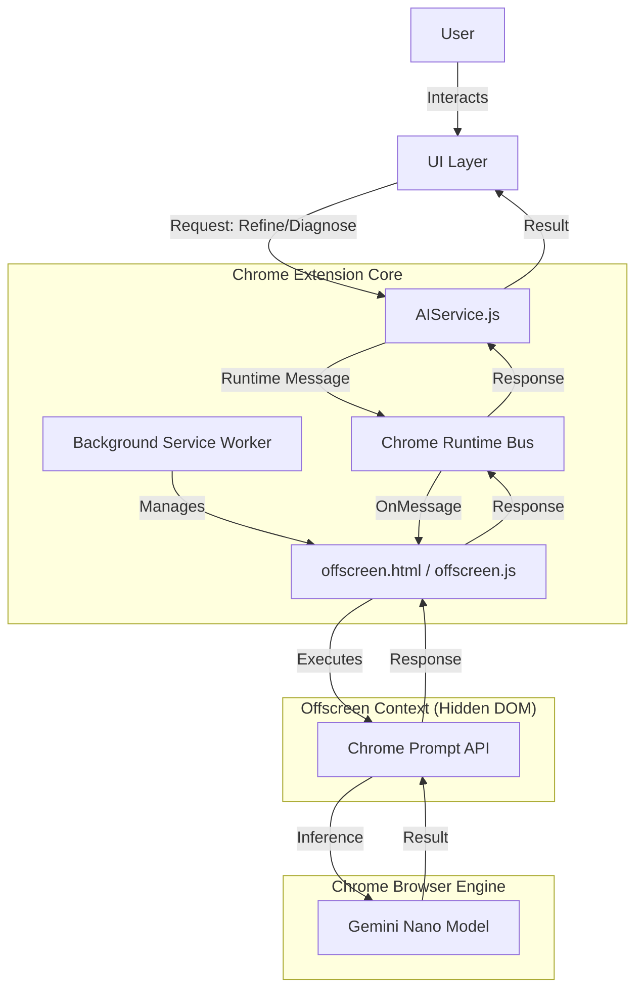
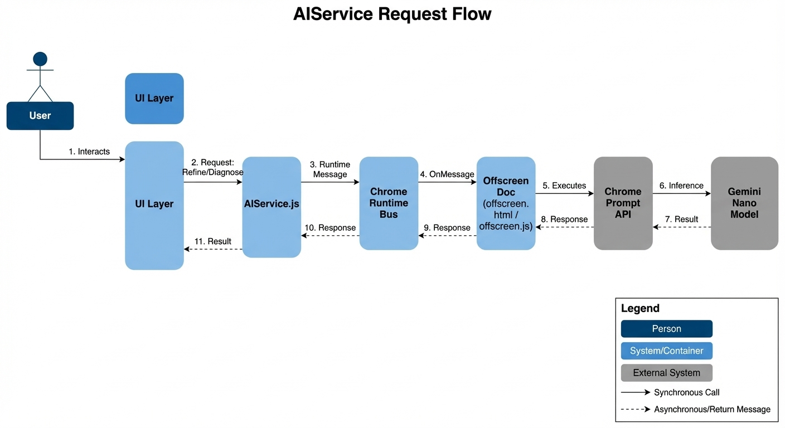

# High-Level Design (HLD): Built-in AI (Gemini Nano) Integration

## 1. Introduction
This document provides the High-Level Design for integrating Google Chrome's **Built-in AI (Gemini Nano)** into the PromptKeeper extension. The goal is to enable zero-latency, privacy-first, on-device AI capabilities (summarization, rewriting, smart expansion) without relying on external cloud APIs.

**Reference**: [ADR 004: Built-In AI Integration](adr/004-built-in-ai-integration.md)

## 2. System Architecture
The integration relies on a **Centralized Offscreen Bridge** pattern. Chrome's security model restricts access to the `window.ai` (or `self.ai`) API to specific contexts. Service Workers (Background) cannot access it directly, and Side Panels/Popups are transient. To ensure reliable, 24/7 availability for background tasks and potential content script injections, we host the AI execution in a dedicated **Offscreen Document**.

### 2.1 C4 Container Diagram (Concept)





```c4x
%%{ c4: component }%%
graph TB

User[User<br/>Person<br/>Extension User]

subgraph ChromeExtensionCore {
    UI[UI Layer<br/>Component<br/>React/HTML]
    AIService[AIService<br/>Component<br/>JavaScript]
    Router[Chrome Runtime Bus<br/>Component<br/>Chrome API]
    Background[Background Service Worker<br/>Component<br/>JavaScript]
}

subgraph OffscreenContext {
    OffscreenDoc[Offscreen Document<br/>Component<br/>HTML/JS]
}

subgraph ChromeBrowserEngine {
    PromptAPI[Chrome Prompt API<br/>Component<br/>Native Browser API]
    Model[Gemini Nano Model<br/>Component<br/>On-device LLM]
}

User -->|Interacts| UI
UI -->|Request Refine or Diagnose| AIService
AIService -->|Runtime Message| Router
Background -->|Manages| OffscreenDoc
Router -->|OnMessage| OffscreenDoc
OffscreenDoc -->|Executes| PromptAPI
PromptAPI -->|Inference| Model
Model -->|Result| PromptAPI
PromptAPI -->|Response| OffscreenDoc
OffscreenDoc -->|Response| Router
Router -->|Response| AIService
AIService -->|Result| UI
```

## 3. Component Breakdown

### 3.1 AIService.js (The Broker)
- **Role**: The single point of entry for all AI operations within the extension.
- **Responsibility**: 
  - Abstracts the messaging complexity from UI components (`options.js`, `sidepanel.js`).
  - Sends asynchronous requests (`checkAIAvailability`, `refinePrompt`) via `chrome.runtime.sendMessage`.
  - Handling timeouts and error normalization.

### 3.2 Background Service Worker (`background.js`)
- **Role**: Lifecycle Manager.
- **Responsibility**:
  - Initializes the **Offscreen Document** (`offscreen.html`) on startup (`runtime.onStartup`).
  - Ensures the offscreen document creates with the specific reason `DOM_SCRAPING` (required for DOM access) and justification.
  - Handles `reinitializeAIBridge` requests if the offscreen document crashes or closes.

### 3.3 The Offscreen Bridge (`offscreen.html` + `offscreen.js`)
- **Role**: Execution Environment.
- **Responsibility**:
  - The **ONLY** component with direct access to `window.ai` / `window.ai.languageModel`.
  - **Capabilities Check**: Queries `window.ai.languageModel.capabilities()` to report status (Readily, After-Download, No).
  - **Session Management**: Creates and destroys `LanguageModel` sessions.
  - **Execution**: Runs the actual inference (`session.prompt()`) and optional `Rewriter`/`Summarizer` API calls.
  - **Fallback**: Gracefully handles `undefined` APIs (if flags are missing).

### 3.4 Diagnostics & Remediation
- **`gemini-diagnostic.html`**:
  - Performs a **Dual Check**:
    1.  **Local Context**: Often returns "Missing" (Expected behavior).
    2.  **Offscreen Context**: Must return "Available" for success.
  - Provides deep links to `chrome://flags` and `chrome://components`.
- **`gemini-help.html`**:
  - User-facing guide for the "Loop": Enable Flags -> Restart -> Check Download -> Fix Stuck Download.

## 4. Workflows

### 4.1 Initialization Flow
1. Extension Loads -> `background.js` runs.
2. `background.js` calls `chrome.offscreen.createDocument({ url: 'offscreen.html', reasons: ['DOM_SCRAPING']... })`.
3. `offscreen.js` loads and logs "Ready".

### 4.2 AI Execution Flow
1. User clicks "Magic Enhance" in Side Panel.
2. `sidepanel.js` calls `AIService.refinePrompt(text, 'magic_enhance')`.
3. `AIService` broadcasts message `['refinePrompt', text]`.
4. `offscreen.js` receives message:
   - Validates `window.ai` existence.
   - Creates a new `LanguageModel` session (optionally with `systemPrompt` or `initialPrompts`).
   - Calls `session.prompt(text)`.
   - Destroys session (to free VRAM).
5. Result is sent back up the chain to the Side Panel.

## 5. Technical Specification & Constraints

### 5.1 Environment Requirements
- **Chrome Version**: 128+ (Experimental), 143+ (Stable Target).
- **APIs Used**: `chrome.offscreen`, `chrome.runtime`, `window.ai` (Experimental).
- **Permissions**: `offscreen`, `sidePanel`.

### 5.2 Hardware Constraints
- **GPU**: Discrete GPU recommended (4GB+ VRAM).
- **Disk**: ~22GB free space (for model download/swapping).
- **Flag Overrides**: 
  - `OptimizationGuideOnDeviceModel`: Must be `Enabled BypassPerfRequirement` on lower-end hardware to force availability.

## 6. Security & Privacy
- **Local Execution**: All inference happens on-device. No prompt data is sent to Google Cloud or PromptKeeper servers.
- **Isolation**: The Offscreen Document is sandbox-isolated and does not have access to the user's active tab content unless explicitly passed via message.

## 7. Future Considerations (v2.2+)
- **Streaming Responses**: Update `offscreen.js` to support `session.promptStreaming()` for real-time feedback.
- **Advanced Parameters**: Expose `topK` and `temperature` through `AIService` for power users.
- **Session Persistence**: Keep sessions alive for multi-turn conversations (Chat Mode).
