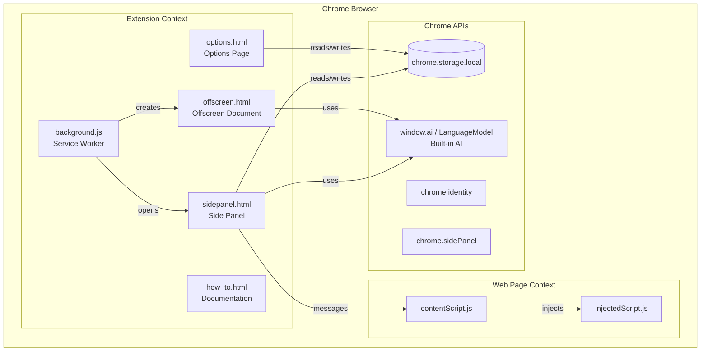
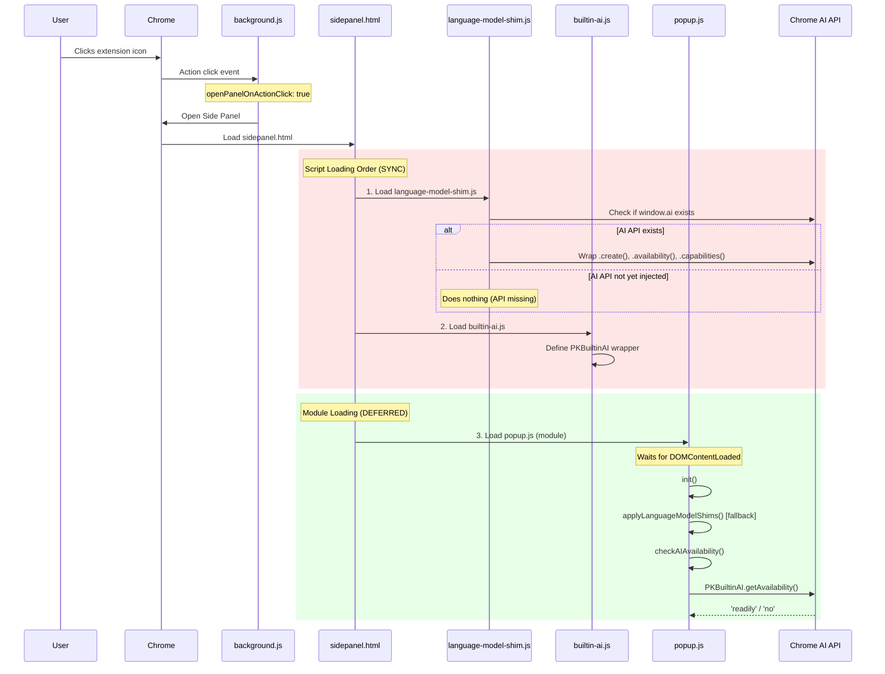
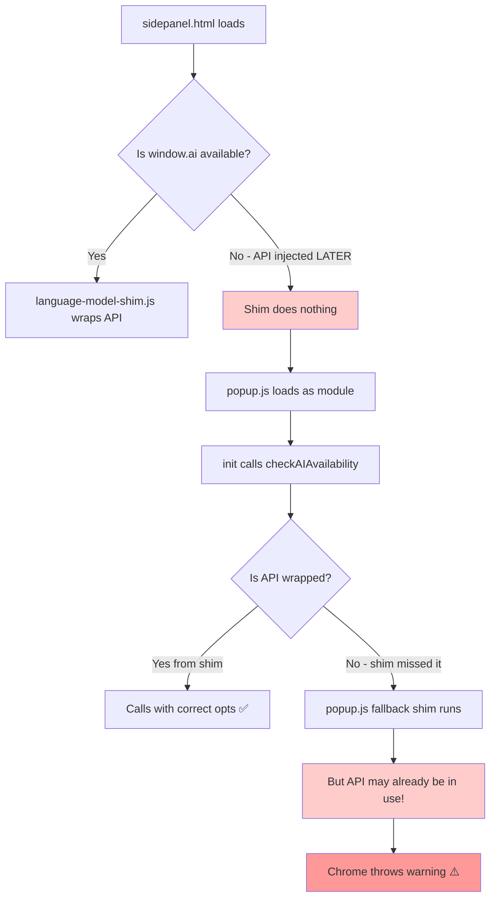
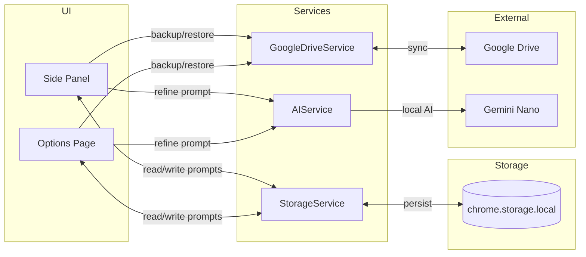

# PromptKeeper Extension - Low-Level Design (LLD)

## 1. Architecture Overview



---

## 2. Component Relationships

| Component | File(s) | Purpose |
|-----------|---------|---------|
| **Service Worker** | `background.js` | Lifecycle management, offscreen doc creation, side panel behavior |
| **Side Panel** | `sidepanel.html` + `popup.js` | Main UI when clicking extension icon |
| **Options Page** | `options.html` + `options.js` | Full-featured editor, settings |
| **Offscreen Document** | `offscreen.html` | AI bridge (runs Gemini Nano in DOM context) |
| **Content Script** | `contentScript.js` | Listens for paste-to-page messages |
| **Storage Service** | `services/StorageService.js` | CRUD for prompts/projects |
| **AI Service** | `services/AIService.js` | AI operations (local or via offscreen) |
| **Google Drive Service** | `services/GoogleDriveService.js` | Backup/restore to Drive |

---

## 3. What Happens When You Click the PromptKeeper Icon



---

## 4. The Error: Root Cause Analysis

### Error Message
```
No output language was specified in a LanguageModel API request.
Context: sidepanel.html
Stack Trace: sidepanel.html:0 (anonymous function)
```

### Why This Happens



### The Race Condition
1. **`language-model-shim.js`** runs synchronously **IMMEDIATELY** when parsed
2. At that moment, `window.ai` might not exist yet (Chrome injects it asynchronously)
3. Since `window.ai` doesn't exist, the shim does nothing
4. Later, `popup.js` runs and Chrome has now injected `window.ai`
5. `popup.js` tries to use `window.ai.languageModel.capabilities()` 
6. The API is called WITHOUT the language options → **Chrome throws warning**

---

## 5. Script Loading Timeline

```
┌─────────────────────────────────────────────────────────────────────────────┐
│                        sidepanel.html Loading Timeline                       │
├─────────────────────────────────────────────────────────────────────────────┤
│ Time →                                                                       │
│                                                                              │
│ [Parse HTML Start]                                                           │
│ │                                                                            │
│ ├─► language-model-shim.js (SYNC) ─┬─► window.ai? NO → skip wrapping        │
│ │                                  └─► window.LanguageModel? NO → skip      │
│ │                                                                            │
│ ├─► builtin-ai.js (SYNC) ──────────► Define PKBuiltinAI                     │
│ │                                                                            │
│ ├─► libs/marked.min.js (SYNC) ─────► Markdown parser                        │
│ │                                                                            │
│ ├─► popup.js (MODULE/DEFERRED) ────┬─► Waits for DOMContentLoaded           │
│ │                                  │                                         │
│ │   [Chrome injects window.ai]     │  ← AI API becomes available HERE       │
│ │                                  │                                         │
│ │                                  └─► init() → checkAIAvailability()       │
│ │                                       └─► Calls unwrapped API! ⚠️          │
│ │                                                                            │
│ [Parse HTML End]                                                             │
└─────────────────────────────────────────────────────────────────────────────┘
```

---

## 6. Data Flow



---

## 7. Proposed Fix

The shim runs too early. We need to **defer the AI initialization** until we're sure the API is available.

### Option A: Lazy Shimming (Recommended)
Instead of shimming at load time, shim lazily when the API is first accessed:

```javascript
// In popup.js init(), BEFORE calling checkAIAvailability():
await waitForAIAPI(); // Wait for window.ai to be injected
applyLanguageModelShims(); // NOW shim it
checkAIAvailability(); // Safe to call
```

### Option B: Use MutationObserver or polling
Watch for `window.ai` to appear before calling any AI methods.

### Option C: Move all AI calls to Offscreen Document
The offscreen document loads in a full DOM context where the API is reliably available.

---

## 8. Key Files to Review

| File | Lines | Purpose |
|------|-------|---------|
| language-model-shim.js | 1-52 | Early shim (runs too soon) |
| builtin-ai.js | 1-137 | PKBuiltinAI wrapper |
| popup.js | 50-111 | Fallback shim + init |
| services/AIService.js | 86-107 | getAvailability() |
